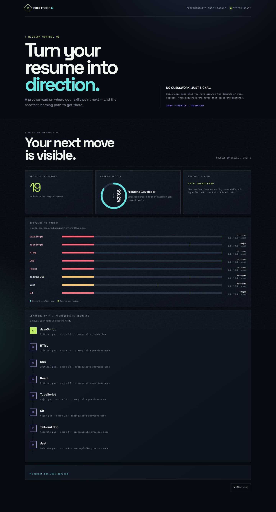

 

# ◆ SKILLFORGE AI

### A resume signal engine for your next move.

**Career direction. Skill gaps. Prerequisite-aware learning paths.**

 

  

 
<b>Signal in. Direction out.</b>

 

> [!IMPORTANT]
> This repository contains the SkillForge AI final-year-project system alongside the original AIML internship archive. The full product documentation lives in <a href="SkillForge_AI/README.md">SkillForge_AI/README.md</a>.

## Featured project: SkillForge AI

SkillForge AI turns a PDF resume into an explainable development trajectory:

PDF resume  →  skill profile  →  career match  →  gap analysis  →  learning path

### What makes it distinctive

| Layer | Purpose |
|---|---|
| **Deterministic core** | Parse resumes, extract canonical skills, normalize aliases, and preserve evidence. |
| **Reasoning engine** | Rank careers with weighted cosine similarity and calculate proficiency deficits. |
| **Learning graph** | Order missing skills with NetworkX prerequisites and deterministic tie-breaking. |
| **Interaction layer** | Expose structured JSON through FastAPI and visualize direction in a static dashboard. |

### Project highlights

- 101 canonical skills and 15 curated careers
- 62 prerequisite relationships and 116 career-skill requirements
- Phase 6 evaluation of dictionary extraction, spaCy EntityRuler, and DistilBERT NER
- Phase 14 live FastAPI workflow with a visual mission-control interface
- Professional final submission report with diagrams, screenshots, metrics, and traceability

## Explore the SkillForge project

| Link | Open |
|---|---|
| Product README | [SkillForge AI overview](SkillForge_AI/README.md) |
| Architecture | [System architecture](SkillForge_AI/docs/SYSTEM_ARCHITECTURE.md) |
| API | [API reference](SkillForge_AI/docs/API_REFERENCE.md) |
| Final report | [Full DOCX documentation](SkillForge_AI/docs/SkillForge_AI_Final_Submission_Report.docx) |
| Live app | [skillforgeaitest.replit.app](https://skillforgeaitest.replit.app) |

## Repository archive

The original internship work remains available beside the SkillForge project:

- Exploratory data analysis
- Data cleaning and preprocessing
- Data visualization
- Regression and classification models
- Model evaluation metrics
- Employee datasets in data/

 

One repository. Two chapters. A visible path from learning fundamentals to building an explainable AI system.

