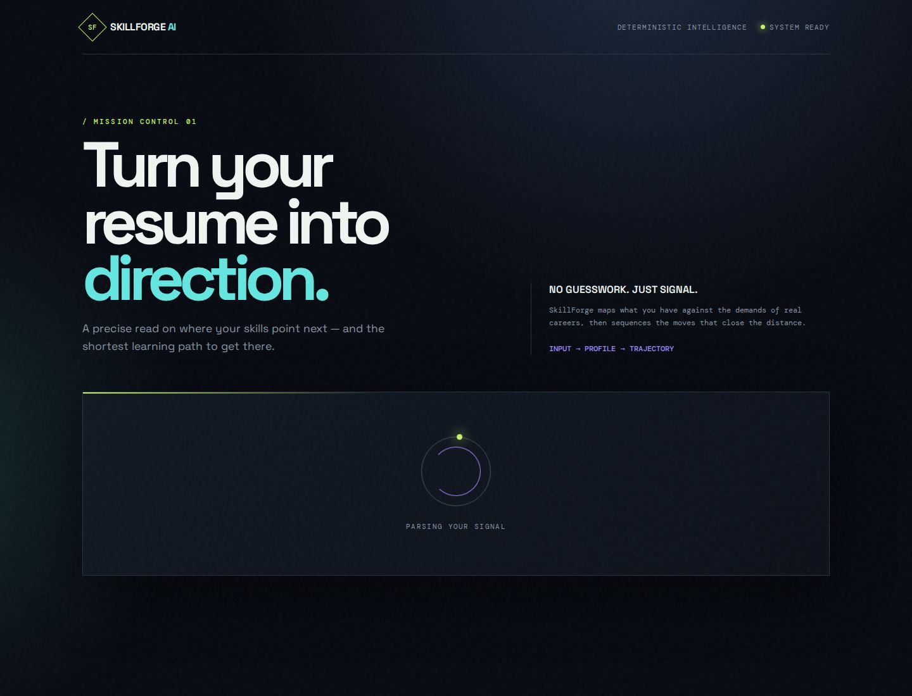
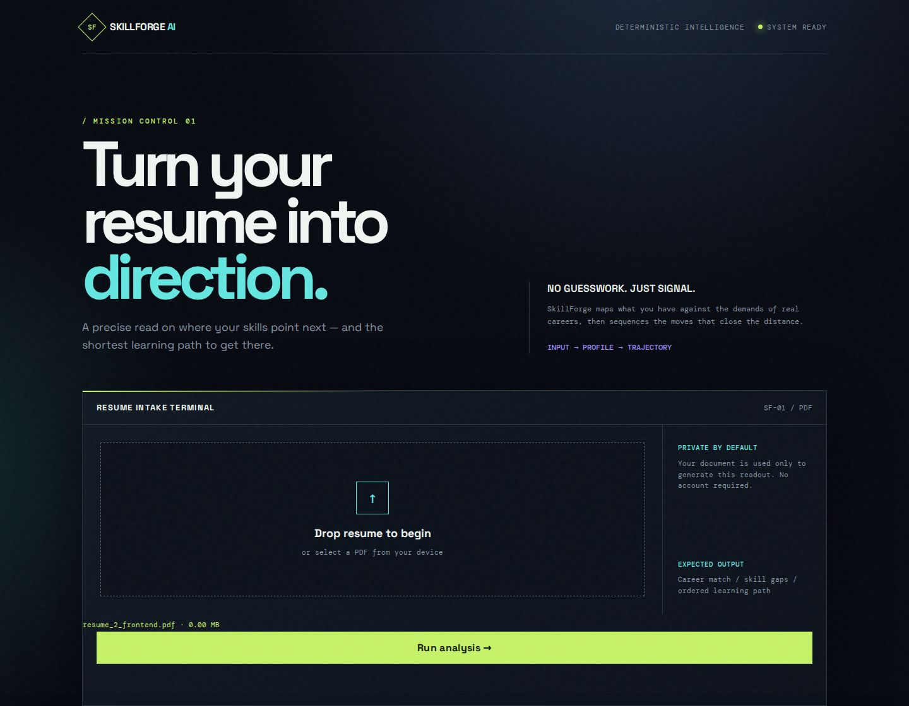

<div align="center">

<br />

# ◆ SKILLFORGE <span style="color:#19d3d1">AI</span>

### Turn your resume into direction.

**A deterministic resume-intelligence system for career matching, skill-gap analysis, and prerequisite-aware learning paths.**

<br />

<a href="https://skillforgeaitest.replit.app">
  
</a>
<a href="https://github.com/arslannhashmi/AIML-Internship-Arslan_Hashmi/tree/main/SkillForge_AI">
  
</a>

<br /><br />


<br /><br />


<br />
<sub><b>Signal in. Direction out.</b> The interface turns structured pipeline output into a visual mission-control dashboard.</sub>

</div>

<br />

> [!IMPORTANT]
> SkillForge AI is an explainable final-year-project prototype. Its knowledge base and evaluation corpus are controlled and synthetic. The saved metrics demonstrate reproducible pipeline behavior; they are not claims of real-resume generalization or hiring accuracy.

## The idea

Resume skill lists are noisy, inconsistent, and disconnected from a concrete plan. SkillForge AI closes that gap with a transparent chain:

```text
PDF resume  →  skill profile  →  career direction  →  proficiency gaps  →  learning trajectory
```

The code makes the decisions. The API returns the evidence. The learning path respects prerequisites instead of producing a flat list of buzzwords.

## Why it feels different

<table>
<tr>
<td width="25%" align="center"><h3>01</h3><b>Read the signal</b><br /><sub>Extract canonical skills from resume text with section-aware evidence.</sub></td>
<td width="25%" align="center"><h3>02</h3><b>Match the direction</b><br /><sub>Compare the learner profile with weighted career vectors.</sub></td>
<td width="25%" align="center"><h3>03</h3><b>Expose the distance</b><br /><sub>Measure proficiency depth, not just keyword presence.</sub></td>
<td width="25%" align="center"><h3>04</h3><b>Sequence the move</b><br /><sub>Order unfinished skills around prerequisite relationships.</sub></td>
</tr>
</table>

## The pipeline at a glance

```mermaid
flowchart LR
    A[Resume PDF] --> B[Parse + clean]
    B --> C[Dictionary / regex extraction]
    C --> D[Canonical skill profile]
    D --> E[Importance-weighted career vectors]
    E --> F[Cosine career ranking]
    F --> G[Proficiency gap arithmetic]
    G --> H[NetworkX prerequisite graph]
    H --> I[Ordered learning path]
    I --> J[FastAPI + visual dashboard]

    classDef input fill:#10202b,stroke:#19d3d1,color:#f7fbff;
    classDef core fill:#10202b,stroke:#9b7cff,color:#f7fbff;
    classDef output fill:#10202b,stroke:#c7ff42,color:#f7fbff;
    class A,J input;
    class B,C,D,E,F,G,H,I core;
```



### What happens under the hood?

| Stage | The system does | Output |
|---|---|---|
| **Parse** | Reads PDF text with PyMuPDF and pdfplumber fallback | Cleaned resume sections |
| **Extract** | Applies dictionary/regex matching with word-boundary guards | Skill mentions with spans |
| **Normalize** | Resolves aliases, full-string fuzzy matches, then calibrated semantic matches | Canonical skill identities |
| **Recommend** | Scores weighted learner and career vectors with cosine similarity | Ranked career list |
| **Analyze** | Applies `importance × max(target − current, 0)` | Gap records and buckets |
| **Sequence** | Runs prerequisite-safe Kahn ordering over a NetworkX graph | Learning trajectory |

## The model stack

<table>
<tr>
<td width="50%">

### Live decision path

- Deterministic dictionary + regex extraction
- Alias matching
- Full-string RapidFuzz fallback
- Importance-weighted cosine similarity
- Explicit gap formula and calibrated buckets
- NetworkX prerequisite graph

</td>
<td width="50%">

### Evaluated model path

- spaCy EntityRuler
- `distilbert-base-uncased` token classification
- `sentence-transformers/all-MiniLM-L6-v2`
- Raw Transformers mean pooling
- Empirical semantic threshold calibration

</td>
</tr>
</table>

> [!NOTE]
> DistilBERT is the only deep-learning component. It is evaluated in Phase 6, while the live upload route uses the deterministic dictionary matcher because it won by F1 on the controlled held-out set.

## Results that are easy to inspect

<div align="center">

| Evaluation | Result |
|---|---:|
| Canonical skills | **101** |
| Curated careers | **15** |
| Prerequisite edges | **62** |
| Career-skill requirements | **116** |
| Phase 6 held-out mentions | **39** |
| Live frontend profile skills | **19** |
| Live top career | **Frontend Developer** |
| Live career score | **0.9916560553218191** |
| Live roadmap length | **8 skills** |

</div>

### Phase 6 extraction snapshot

| Stage | Precision | Recall | F1 |
|---|---:|---:|---:|
| Dictionary baseline | 1.0000 | 1.0000 | **1.0000** |
| spaCy EntityRuler | 1.0000 | 1.0000 | **1.0000** |
| DistilBERT NER | 1.0000 | 0.8974 | **0.9459** |

## The dashboard

The static interface is intentionally lightweight: plain HTML, CSS, and vanilla JavaScript served directly by FastAPI. No frontend build step is required.

<table>
<tr>
<td align="center"><br /><sub><b>01 / Intake</b><br />Upload a PDF resume.</sub></td>
<td align="center"><br /><sub><b>02 / Analysis</b><br />Follow the processing signal.</sub></td>
</tr>
<tr>
<td align="center"><br /><sub><b>03 / Direction</b><br />See the career match and gap profile.</sub></td>
<td align="center"><br /><sub><b>04 / Evidence</b><br />Keep the interaction focused.</sub></td>
</tr>
</table>

## API surface

| Method | Route | Purpose |
|---|---|---|
| `GET` | `/health` | Service status and phase |
| `POST` | `/profile/resume` | Upload, parse, extract, and persist a profile |
| `GET` | `/careers/{user_id}/recommendations` | Rank the curated career set |
| `GET` | `/gap/{user_id}/{career_id}` | Return requirement-level proficiency gaps |
| `GET` | `/roadmap/{user_id}/{career_id}` | Return prerequisite-aware learning path |
| `POST` | `/agent/{user_id}/run` | Run the full Phase 12 structured pipeline |

Example:

```bash
curl http://localhost:8080/health
```

```json
{
  "status": "ok",
  "phase": "14"
}
```

## Run it locally

### 1. Start the API

```bash
sh artifacts/api-server/run-skillforge.sh
```

### 2. Open the interface

```text
http://localhost:8080/
```

### 3. Check service health

```text
http://localhost:8080/health
```

The wrapper configures the project database and Python import path automatically. The explicit command is:

```bash
SKILLFORGE_DB_PATH="$PWD/skillforge/db/skillforge.db" \
PYTHONPATH="$PWD/skillforge" \
python3.12 -m uvicorn backend.main:app \
  --app-dir skillforge --host 0.0.0.0 --port 8080
```

<details>
<summary><b>Runtime notes</b></summary>

<br />

- Authoritative local database path: `SKILLFORGE_DB_PATH=db/skillforge.db`
- SQLite is used for local/development persistence through `db_client`
- The source schema is PostgreSQL-compatible and translated during SQLite initialization
- Learning paths are computed in memory; they are not persisted in a `learning_paths` table
- Uploaded resumes are processed by the FastAPI backend and returned as structured JSON

</details>

## Project map

```text
skillforge/
├── backend/          FastAPI routes + static interface
├── parser/           PDF extraction, cleaning, section detection
├── extraction/       dictionary, spaCy, DistilBERT evaluation
├── normalization/    alias, fuzzy, semantic matching
├── knowledge_base/   NetworkX prerequisite graph
├── recommendation/   weighted vectors + career ranking
├── gap_analysis/     proficiency gap arithmetic
├── learning_path/    prerequisite-safe ordering
├── agent/            Phase 12 deterministic orchestrator
├── data/             taxonomy, careers, requirements, fixtures
├── evaluation/       saved Phase 6 / 7 / 9 evidence
└── tests/            parser, graph, recommendation, gap, and agent tests
```

## Scope, honesty, and boundaries

### Implemented

- Phases 3–12: data, parsing, extraction, normalization, graph, recommendation, gap, learning path, orchestration
- Phase 14: FastAPI backend, static dashboard, live smoke flow
- Phases 16–17: evaluation documentation and basic deployment configuration

### Intentionally omitted

- Phase 13 LLM explanation layer
- Neo4j
- K-Means clustering
- The larger multi-agent framework
- Independent real-resume benchmark
- The deferred separate/full frontend scope

> [!WARNING]
> Career match measures skill coverage, while gap analysis measures proficiency depth. A high career score can coexist with meaningful learning gaps by design.

## Documentation suite

| Document | What it contains |
|---|---|
| [System architecture](docs/SYSTEM_ARCHITECTURE.md) | Architecture, data flow, ERD, and module tree |
| [API reference](docs/API_REFERENCE.md) | Routes, contracts, errors, and live response excerpts |
| [Final report](docs/FINAL_REPORT.md) | Methodology, evaluation, limitations, and traceability |
| [Final submission DOCX](docs/SkillForge_AI_Final_Submission_Report.docx) | Professional full-project report with diagrams and screenshots |

## Live application

<div align="center">

### [Open SkillForge AI →](https://skillforgeaitest.replit.app)

<sub>Input → Profile → Trajectory</sub>

</div>

## Final project statement

SkillForge AI is not a black-box career oracle. It is a transparent direction engine:

```text
The resume is the signal.
The knowledge base is the context.
The graph is the order.
The code is the decision-maker.
```

<div align="center">
<sub>Built as an explainable final-year-project system with a deterministic core.</sub>
</div>