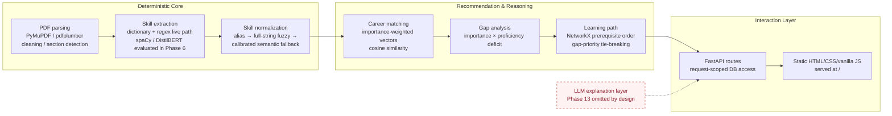
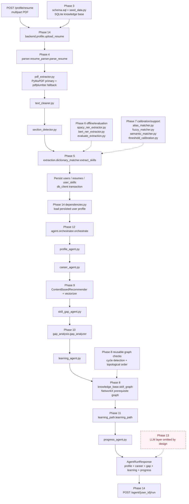
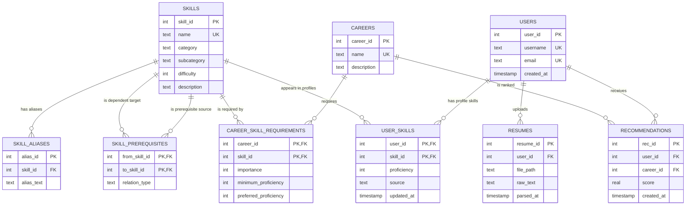

# SkillForge AI — System Architecture

## As-built scope

This document describes the implemented Phases 3–14 pipeline. The system is
deterministic at every decision point: parsing, skill extraction,
normalization, career ranking, gap arithmetic, and learning-path ordering do
not delegate decisions to an LLM. Phase 13's explanation layer is omitted by
design.

## Three-layer architecture



The live API profile route currently persists dictionary matches directly.
Phase 7 normalization and the Phase 6 NER models are real project modules and
evaluation artifacts, but they are not an unconditionally chained runtime
stage in the Phase 14 upload handler.

## Full data pipeline: Phases 3–14

The solid path below is the live resume-upload and agent path. Dashed nodes
are real offline evaluation/calibration or reusable supporting modules that
were built during the corresponding phase but are not all invoked by the
single live upload handler.



## Entity-relationship diagram

The actual on-disk schema contains **nine tables**, as confirmed by
`skillforge/schema.sql` and the SQLite database. The uploaded documentation
brief listed `learning_paths` as an additional name while calling the schema
nine-table; there is no `learning_paths` table in the implementation.
Learning paths are computed in memory by the Phase 11 module and returned in
`RoadmapResponse` and `AgentRunResponse`.



## As-built module tree

```text
skillforge/
├── schema.sql                         Phase 3: nine-table source schema
├── data/
│   ├── seed_data.py                   Phase 3: curated taxonomy and careers
│   ├── *_export.json                  Phase 3: table snapshots
│   └── labeled_resumes/               Phase 6: synthetic labels and PDFs
├── db/
│   ├── init_db.py                     Phase 3: SQLite initialization/validation
│   └── db_client.py                   SQLite/Postgres access abstraction
├── parser/
│   ├── pdf_extractor.py               Phase 4: PDF text extraction
│   ├── text_cleaner.py                Phase 4: text normalization
│   ├── section_detector.py            Phase 4: resume section detection
│   └── resume_parser.py               Phase 4: parser entry point
├── extraction/
│   ├── dictionary_matcher.py          Phase 5: deterministic live extractor
│   ├── spacy_ner_extractor.py         Phase 6: EntityRuler evaluation stage
│   ├── bert_ner_extractor.py          Phase 6: DistilBERT evaluation stage
│   └── evaluate_extraction.py         Phase 6: held-out metrics
├── normalization/
│   ├── alias_matcher.py               Phase 7: exact alias resolution
│   ├── fuzzy_matcher.py               Phase 7: full-string RapidFuzz fallback
│   ├── semantic_matcher.py            Phase 7: calibrated semantic fallback
│   ├── threshold_calibration.py       Phase 7: saved cutoff calibration
│   └── normalization_pipeline.py      Phase 7: deterministic ordering
├── knowledge_base/
│   └── skill_graph.py                 Phase 8: in-memory NetworkX graph
├── recommendation/
│   ├── vectorizer.py                  Phase 9: weighted vector construction
│   ├── content_based_recommender.py   Phase 9: career ranking
│   └── evaluate_recommender.py        Phase 9: face-validity fixtures
├── gap_analysis/
│   └── gap_analyzer.py                Phase 10: gap arithmetic and buckets
├── learning_path/
│   └── learning_path.py               Phase 11: prerequisite-safe ordering
├── agent/
│   ├── profile_agent.py               Phase 12: profile stage
│   ├── career_agent.py                Phase 12: career stage
│   ├── skill_gap_agent.py             Phase 12: gap stage
│   ├── learning_agent.py              Phase 12: learning stage
│   ├── progress_agent.py              Phase 12: coverage summary
│   └── orchestrator.py                Phase 12: final structured pipeline
├── backend/
│   ├── main.py                        Phase 14: FastAPI app and static mount
│   ├── profile.py                     Phase 14: upload/profile route
│   ├── careers.py                     Phase 14: recommendations route
│   ├── gap.py                         Phase 14: gap route
│   ├── roadmap.py                     Phase 14: roadmap route
│   ├── agent.py                       Phase 14: direct Phase 12 route
│   └── static/index.html              Current lightweight interaction surface
├── [Phase 13 omitted]                 No LLM client, prompts, guardrails, or API key
└── [Phase 15 omitted by design]       Original separate/full frontend scope deferred;
                                      the current static page is not that scope
```

## Persistence and runtime boundaries

- `SKILLFORGE_DB_PATH` selects the SQLite database; this avoids accidentally
  selecting an unrelated platform `DATABASE_URL` during local runs.
- FastAPI dependencies create request-scoped connections through `db_client`.
- The learning path is not persisted in a `learning_paths` table; it is derived
  from the gap report and NetworkX graph on request.
- The artifact runner sets the repository-relative database and Python paths so
  the production command is portable.